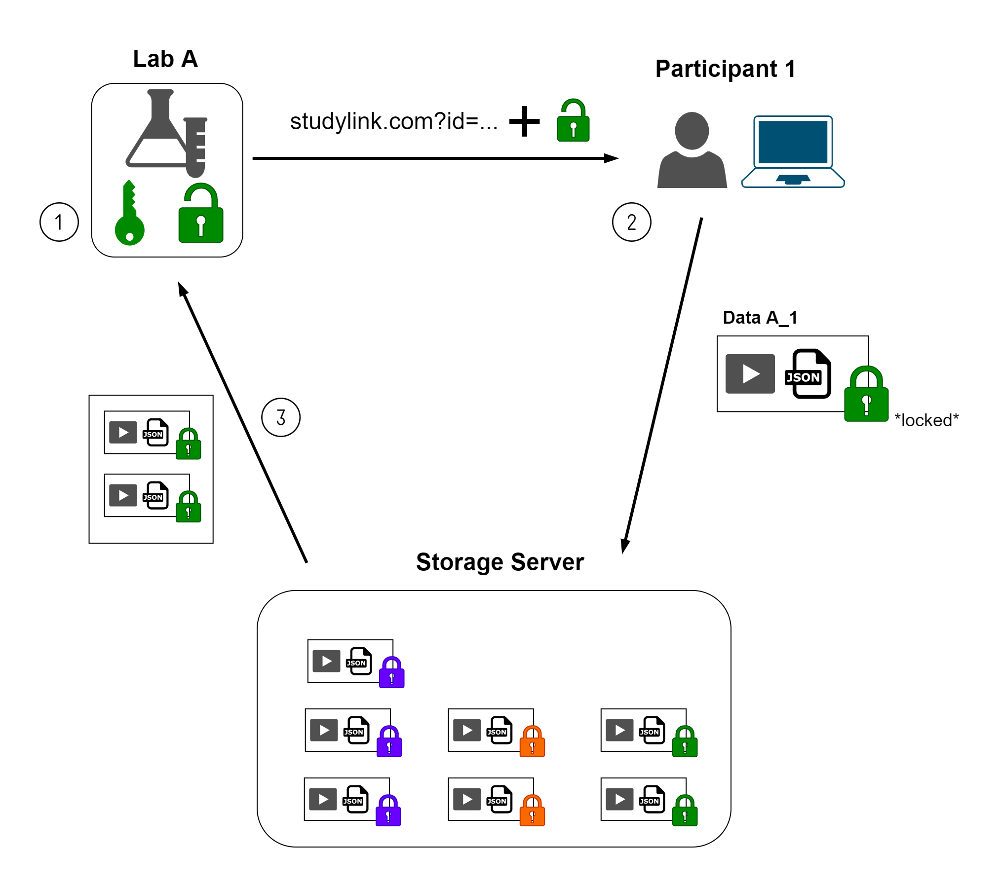

# ManyKeys: Confidential & Centralized Data Collection for Collaborative Online Studies

ManyKeys enables labs to conduct collaborative online studies in a centralized way without exposing the content of their participant data to whoever stores it during collection. By leveraging asymmetrical encryption, ManyKeys ensures that participant data is only decipherable by the lab that the specific participant belongs to.

### Why would I need this?
In collaborative studies, data protection guidelines often forbid labs to store sensitive participant data (such as video recordings) on servers of third parties (such as collaborating labs hosting online studies). Labs often have to install separate instances of the online study software or get new ethics approvals, which is time- and resource-intensive. ManyKeys enables third parties to transmit and store data in a way that ensures the confidentiality of any participant data.

## Example Workflow
The general workflow looks as follows:

1. Participating labs each choose a **username** and **password** and use the `manykeys.py` script to derive a public keystring, which contains the username and a key used for asymmetrical encryption.

2. The centralized (open-sourced) web-frontend gets supplied the keystring (e.g. via GET parameter) and uses the methods implemented in `manykeys.js` to encrypt the data on the participant's device before transmitting it to a centralized data storage.

4. After data collection concludes, the centralized entity uses the usernames to identify labs and sends them their encrypted data.

3. The participating labs receive their data and can use the `manykeys.py` script along with their username and password to decrypt the data. Only then are the contents of the data viewable and can be used for further processing.


<p align="center">

</p>

## Prerequisites

For both usage and development, you will need a [Python3](https://www.python.org/downloads/) installation. You will also need to run 
```
pip3 install -r requirements.txt
``` 
in the root directory after cloning the repository.


## Usage Instructions

### Generate Public Keystring
To generate your public keystring, run the python script without any arguments:

```
python3 manykeys.py
```

The script will display instructions and prompt you to choose your username and password. Your public keystring will be printed and saved to `keystring.txt`. Note that the username and password need to be remembered to restore data! There is no option to restore a lost password.

### Decrypt Files
To decrypt files that have been encrypted with the public keystring, supply the directory containing the `.enc` files as an argument :

```
python3 manykeys.py PATH_TO_DIRECTORY
```

The script will prompt you for your username and password and decrypt the files afterward. The resulting files will be saved in a folder called `decrypted`. 


## Including ManyKeys in your Project

To make your project compatible with ManyKeys, you will need to include [manykeys.js](manykeys.js) in your frontend. 

```html
<script src="manykeys.js"></script>
```
Keep in mind that the frontend needs to be open source, so that collaborating labs could in theory verify if the encryption is implemented correctly.

When collecting data, your app will need to do 2 things:
1. Receive the keystring and extract both the public key and username using `verifyAndReadKeystring`
2. Encrypt the participant data with `encrypt` before transmission

See the examples below and the functions docstrings for further details.

### Example Usages: 

```javascript

/* extracting the public key and username from the keystring */ 

const publicKeyString = new URL(window.location.href).searchParams.get("key");

if (publicKeyString){
    const {key, username} = ManyKeys.verifyAndReadKeystring(publicKeyString);
}   

```

```javascript

/* encryptring text before sending it to the backend */ 

ManyKeys.encrypt(
    new TextEncoder().encode("SENSITIVE_DATA"), 
    key
).then(encstring => xhr.send(...));


```
## Encryption Scheme

 PBKDF2 SHA-256 is used to derive a seed from the specified password in 1000000 iterations, using the username as a salt.
The output is used to seed a CSPRNG (we used the SHAKE256 algorithm to mimic that behavior) to generate a 2048 bit RSA key pair.

The public key is concatenated with the username, delimited by a ";". This string is hashed with SHA256 merely so that the frontend can check for errors introduced while copying the key.
The resulting string (hash + publickey + ";" + username) is base64 encoded to generate the **keystring** the will be specified in that frontend.

When collecting participant data, the frontend decodes the keystring and checks the integrity by running a SHA256 hash over the publickey + ";" + username string.

A CSPRNG then generates a 32 byte long key that is used to to symmetrically encrypt the data using AES-GCM with a mac length of 16 bytes. Afterward, this key is asymmetrically encrypted with the public RSA key, using the PKCS1-OAEP scheme and SHA256 as the hashing algorithm. The encrypted key is concatenated to the encrypted data and encoded as a base64 string before being transmitted to the third party storage.


## Roadmap/Todos

* Package code for the releases page
* minified version of the js library
* GUI for using the python script


## Authors

- **Adrian Steffan** [adriansteffan](https://github.com/adriansteffan) [website](https://adriansteffan.com/)
* **Till Müller** - [TillMueller](https://github.com/TillMueller) - helping with the implementation of the crypto scheme and (most importantly) coming up with the name


## License

This project is licensed under the [GNU GPLv3](LICENSE) - see the [LICENSE](LICENSE) file for
details
